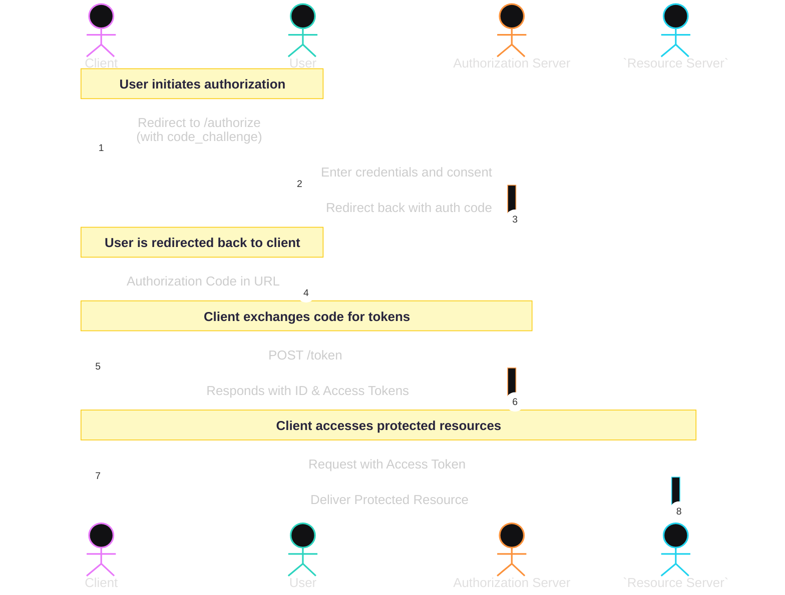

# Flask OIDC Provider

## 🔍 Understanding OpenID Connect (OIDC)

OpenID Connect (OIDC) is an identity layer built on top of the OAuth 2.0 protocol that enables client applications to verify the identity of end-users based on authentication performed by an authorization server. It also provides mechanisms to obtain basic user profile information in an interoperable and secure manner. OIDC is widely used for implementing Single Sign-On (SSO) and for securing modern web and mobile applications.

### 📊 OIDC Authorization Code Flow with PKCE

1. **Client Registration**: The client registers with the OIDC provider and receives a `client_id` and `client_secret`.

2. **Authorization Request**: The client redirects the user to the `/authorize` endpoint, providing `client_id`, `redirect_uri`, `scope`, `state`, and a PKCE `code_challenge`.

3. **User Authentication**: The user is prompted to log in with credentials at the provider.

4. **User Consent**: Upon successful login, the user grants the application access to the requested scopes.

5. **Authorization Code Issuance**: The provider sends an authorization code to the client's redirect URI.

6. **Token Request**: The client exchanges the authorization code and PKCE `code_verifier` at the `/token` endpoint.

7. **Token Response**: The provider issues an ID token (identity), an access token (authorization), and optionally a refresh token.

8. **UserInfo Access**: The client can use the access token to call the `/userinfo` endpoint for user profile data.

9. **Token Introspection or Revocation**: The client may validate or revoke tokens via dedicated endpoints.

The ID token, formatted as a signed JSON Web Token (JWT), encapsulates identity claims about the authenticated user. These claims include information such as the user's unique identifier, authentication time, and issuer details. By being digitally signed, the ID token ensures both the integrity and authenticity of the identity assertion, enabling secure and interoperable authentication across clients and domains.


---

## 🧭 Project Overview

**Flask OIDC Provider** is a modular and standards-compliant implementation of an OpenID Connect (OIDC) identity provider built using Flask. Designed to support secure authentication flows and token-based access for both web and API clients, this project includes:

* Full OIDC Authorization Code Flow with PKCE
* Refresh tokens and token lifecycle management
* Dynamic client registration
* Standards-compliant token revocation and introspection
* JWKS, UserInfo, and discovery endpoints

This provider is ideal for developers building OAuth 2.0/OIDC-integrated systems or needing a customizable, lightweight identity provider for internal services or development.

---

## 🗂️ Repository Structure

Understand the organization of code, assets, and configuration:

```text
flask-oidc-provider/
├── app.py               # Application entry point and routing logic
├── config.py            # Configuration management and key loading
├── models.py            # In-memory structures for client and token state
├── auth/                # Authentication and cryptographic modules
│   ├── token.py         # JWT handling and introspection
│   └── pkce.py          # PKCE challenge/response utilities
├── templates/           # HTML views for login and consent
│   ├── login.html
│   └── consent.html
├── static/              # CSS and static assets
├── jwks.json            # JSON Web Key Set (JWKS) document
├── public.pem           # Public RSA key for token verification
├── private.pem          # Private RSA key for signing
├── requirements.txt     # Dependency list
├── tests/               # Test suite (unit + integration)
│   ├── test_flow.py
│   └── test_jwks.py
├── Dockerfile           # Docker image specification
├── docker-compose.yml   # Docker Compose stack (app + Redis)
├── .github/workflows/   # CI configuration
│   └── ci.yml
└── README.md            # Project documentation
```

---

## 🚀 Core Capabilities

* 🔐 **Authorization Code Flow with PKCE**
* 🔄 **Refresh Token Support**
* 🔍 **Token Introspection & Revocation**
* 📘 **OIDC Discovery & Metadata**
* 👤 **UserInfo Endpoint with Custom Claims**
* 🛡️ **JWT-based Architecture with RS256**
* 🧠 **In-Memory Store**, Redis backend compatible

---

## ➕ Extended Features

1. **Dynamic Client Registration**
2. **OIDC Scopes and Claims Management**
3. **Comprehensive Token Lifecycle Operations**
4. **Security Best Practices (TLS, CSRF, HSTS)**
5. **Monitoring via Prometheus & Structured Logs**
6. **OpenAPI Schema & Development Tooling**
7. **High Test Coverage via Pytest & CI/CD**
8. **Example Client Implementations (SPA, CLI)**

---

## 🛠️ Installation & Setup

```bash
git clone https://github.com/your-org/flask-oidc-provider.git
cd flask-oidc-provider
python3 -m venv venv
source venv/bin/activate
pip install -r requirements.txt
```

### 🔐 Environment Configuration

```ini
FLASK_ENV=production
SECRET_KEY=super-secret-key
PRIVATE_KEY_PATH=./private.pem
PUBLIC_KEY_PATH=./public.pem
ISSUER_URL=https://auth.example.com
TOKEN_EXPIRY=3600
REFRESH_TOKEN_EXPIRY=86400
```

---

## ▶️ Local Development

```bash
export FLASK_ENV=development
flask run --host=0.0.0.0 --port=5000
```

Override configuration using a `.env` file or direct environment variables.

---

## 🔗 API Endpoint Overview

| Method | Path                                | Description                                      |
| ------ | ----------------------------------- | ------------------------------------------------ |
| POST   | `/register`                         | Register a new OIDC client dynamically           |
| GET    | `/.well-known/openid-configuration` | OIDC discovery document                          |
| GET    | `/jwks`                             | Exposes provider public keys (JWKS)              |
| GET    | `/authorize`                        | Initiate user login & authorization              |
| POST   | `/authorize`                        | Process user login and redirect                  |
| POST   | `/consent`                          | Finalize authorization after user consent        |
| POST   | `/token`                            | Exchange code/refresh token for access/ID tokens |
| POST   | `/revoke`                           | Revoke active tokens (access/refresh)            |
| POST   | `/introspect`                       | Token validation and metadata retrieval          |
| GET    | `/userinfo`                         | Returns identity claims based on access token    |

---

## 📡 REST API Usage Examples

Includes both `curl` and Python `requests` snippets for quick integration testing.

### 🔧 Dynamic Client Registration

```bash
curl -X POST https://auth.example.com/register \
  -H 'Content-Type: application/json' \
  -d '{
    "client_name": "my-spa-app",
    "redirect_uris": ["https://app.example.com/callback"],
    "grant_types": ["authorization_code"],
    "response_types": ["code"],
    "scope": "openid profile email"
}'
```

### 🔑 Auth Code Flow (with PKCE)

**Step 1: Generate code verifier and challenge**

```bash
code_verifier=$(openssl rand -base64 32 | tr -d '=+/')
code_challenge=$(echo -n "$code_verifier" | openssl dgst -sha256 -binary | openssl base64 | tr -d '=+/')
```

**Step 2: Redirect User to Authorize Endpoint**

```text
GET https://auth.example.com/authorize?response_type=code&client_id=CLIENT_ID&redirect_uri=https://app.example.com/callback&scope=openid profile email&code_challenge=$code_challenge&code_challenge_method=S256&state=XYZ
```

**Step 3: Exchange Code for Tokens**

```bash
curl -X POST https://auth.example.com/token \
  -H 'Content-Type: application/x-www-form-urlencoded' \
  -d 'grant_type=authorization_code&client_id=CLIENT_ID&code=$AUTH_CODE&redirect_uri=https://app.example.com/callback&code_verifier=$code_verifier'
```

**Python Example**

```python
import requests
response = requests.post('https://auth.example.com/token', data={
    'grant_type': 'authorization_code',
    'client_id': 'CLIENT_ID',
    'code': 'AUTH_CODE',
    'redirect_uri': 'https://app.example.com/callback',
    'code_verifier': 'CODE_VERIFIER'
})
print(response.json())
```

---

## 🐳 Docker Deployment

```bash
docker-compose up --build
```

Configure `.env` for runtime environment overrides such as port, issuer, or token TTLs.

---

## 📦 Production Deployment

### Gunicorn + Nginx

```bash
pip install gunicorn
gunicorn -w 4 -b 0.0.0.0:5000 app:app
```

### Systemd Service

```ini
[Unit]
Description=Flask OIDC Provider
After=network.target

[Service]
User=www-data
WorkingDirectory=/opt/flask-oidc-provider
ExecStart=/opt/flask-oidc-provider/venv/bin/gunicorn -w 4 -b 127.0.0.1:5000 app:app
Restart=always

[Install]
WantedBy=multi-user.target
```

```bash
sudo systemctl enable flask-oidc
sudo systemctl start flask-oidc
```

---

## 🤝 Contributing

We welcome all contributions:

1. Fork the repository
2. Create a feature branch: `git checkout -b feature/your-feature`
3. Write clean, tested code and documentation
4. Open a pull request

See [CONTRIBUTING.md](CONTRIBUTING.md) and [CODE\_OF\_CONDUCT.md](CODE_OF_CONDUCT.md). Visit [GitHub Issues](https://github.com/your-org/flask-oidc-provider/issues) to discover open tasks.

---

## 📄 License

This project is licensed under the [MIT License](LICENSE).

---

*Thank you for your interest and support.*
