# Flask OIDC Provider

## 🔍 Understanding OpenID Connect (OIDC)

OpenID Connect (OIDC) is an identity layer built on top of the OAuth 2.0 protocol, enabling client applications to verify the identity of end-users based on authentication performed by an authorization server. It also allows clients to obtain essential user profile information in a standardized and secure manner. OIDC has become the de facto standard for implementing Single Sign-On (SSO) in modern authentication systems and is a cornerstone for building secure web and mobile applications.

OIDC enhances OAuth 2.0 by adding an ID token, which is a JSON Web Token (JWT) that contains claims about the authentication event and the authenticated user. These features make it ideal for federated identity scenarios, allowing seamless login experiences across platforms and services.

### 📊 OIDC Authorization Code Flow with PKCE

1. **Client Registration**: The client application registers itself with the OIDC provider and is issued a `client_id` and `client_secret` (or is marked as a public client in some cases).

2. **Authorization Request**: The client redirects the user to the `/authorize` endpoint, including parameters such as `client_id`, `redirect_uri`, `scope`, `state`, and a PKCE `code_challenge`.

3. **User Authentication**: The user is presented with a login interface to authenticate using their credentials.

4. **User Consent**: After successful authentication, the user is prompted to consent to the application's access request for specific scopes.

5. **Authorization Code Issuance**: The authorization server redirects the user back to the client with an authorization code.

6. **Token Request**: The client sends a request to the `/token` endpoint, including the received authorization code and the PKCE `code_verifier`.

7. **Token Response**: The provider responds with an ID token (for authentication), an access token (for resource access), and optionally a refresh token (for long-lived sessions).

8. **UserInfo Access**: Using the access token, the client fetches user profile details from the `/userinfo` endpoint.

9. **Token Introspection or Revocation**: The client can introspect or revoke tokens using provider-specific endpoints to maintain token integrity and control.

The ID token, structured as a signed JWT, contains identity claims such as user ID (`sub`), authentication timestamp, and issuer metadata. These tokens are signed using RS256, allowing relying parties to validate token integrity and confirm the issuer. This provides a robust and interoperable mechanism for cross-domain authentication.

```mermaid
---
config:
  theme: redux-dark-color
  sequence:
    messageFontSize: 20
    actorFontSize: 22
    noteFontSize: 18
    actorFontFamily: Arial, sans-serif
    noteFontFamily: Arial, sans-serif
    messageFontFamily: Arial, sans-serif
    diagramMarginX: 50
    diagramMarginY: 30
    actorMargin: 80
    width: 300
    height: 60
    boxMargin: 15
    boxTextMargin: 10
    noteMargin: 15
    messageMargin: 50
    messageFontWeight: bold
    actorFontWeight: bold
    noteFontWeight: bold
  look: handDrawn
---
sequenceDiagram
  participant Client as 💻 Client App
  actor User as 👤 User
  participant AuthServer as 🔐 Authorization<br/>Server
  participant ResourceServer as 🗄️ Resource<br/>Server
  autonumber
  rect rgba(0, 128, 0, 0.1)
    Note over Client, User: 🚀 Authorization Initiation Phase
    Client ->>+ User: Redirect to /authorize<br/>(with code_challenge)
    User ->>+ AuthServer: Enter credentials and consent
    AuthServer -->>- User: Redirect back with auth code
  end
  rect rgba(0, 0, 255, 0.1)
    Note over Client, User: 🔄 Code Exchange Phase
    User ->>+ Client: Return authorization code
    Client ->>+ AuthServer: POST /token<br/>(code + code_verifier)
    AuthServer -->>- Client: Respond with ID & Access Tokens
  end
  rect rgba(128, 0, 128, 0.1)
    Note over Client, ResourceServer: 🔑 Resource Access Phase
    Client ->>+ ResourceServer: Request with Access Token<br/>in Authorization header
    ResourceServer -->>- Client: Deliver Protected Resource
  end
```



---

## 🧭 Project Overview

**Flask OIDC Provider** is a modular, lightweight, and standards-compliant implementation of an OpenID Connect (OIDC) identity provider built on Flask. It supports secure authentication flows, token issuance, user profile delivery, and token lifecycle management for web and API clients. Built with extensibility in mind, the project supports multiple OAuth2/OIDC extensions and deployment configurations.

Key features include:

* Complete OIDC Authorization Code Flow with PKCE for public clients
* Refresh token support and automatic expiration handling
* Support for dynamic client registration as per OIDC standards
* Secure token revocation and introspection endpoints
* Public key delivery via JWKS endpoint and metadata discovery
* Custom claims in ID tokens and UserInfo responses
* Compatibility with frontend SPAs and backend services

This project is suitable for internal authentication gateways, microservice SSO providers, proof-of-concept apps, and education on OAuth2/OIDC systems.

---

## 🗂️ Repository Structure

```text
flask-oidc-provider/
├── app.py               # Main Flask app with route registration
├── config.py            # Environment configuration and key loading
├── models.py            # Definitions for client, token, and user memory stores
├── auth/                # Authentication logic and helper utilities
│   ├── token.py         # JWT creation, validation, and introspection
│   └── pkce.py          # PKCE implementation for secure code flows
├── templates/           # Jinja2 templates for login and consent views
│   ├── login.html
│   └── consent.html
├── static/              # CSS stylesheets and client assets
├── jwks.json            # Public key in JWKS format
├── public.pem           # Public RSA key used for JWT verification
├── private.pem          # Private RSA key used for JWT signing
├── requirements.txt     # Python dependencies
├── tests/               # Unit and integration test suite
│   ├── test_flow.py
│   └── test_jwks.py
├── Dockerfile           # Docker container definition
├── docker-compose.yml   # Docker Compose config (API + Redis)
├── .github/workflows/   # GitHub Actions CI/CD workflow
│   └── ci.yml
└── README.md            # Project documentation and usage guide
```

---

## 🚀 Core Capabilities

* Secure Authorization Code Flow with PKCE support
* Long-term session management via Refresh Tokens
* OAuth2 token introspection and revocation endpoints
* OIDC metadata and discovery endpoint for dynamic config
* Customizable UserInfo responses with claim configuration
* Secure JWT architecture using RS256 key pairs
* In-memory stores with Redis backend compatibility

---

## ➕ Extended Features

1. Dynamic registration for third-party clients
2. Full support for custom scopes and claims mapping
3. Configurable access/refresh token TTLs
4. Security features: TLS support, CSRF protection, HSTS
5. Monitoring integration via Prometheus and structured logging
6. OpenAPI (Swagger) specs for endpoint documentation
7. Continuous testing via Pytest and GitHub Actions
8. Example applications (Single Page App, CLI tool)
9. Development support with .env override and hot reload

---

## 🛠️ Installation & Setup

```bash
git clone https://github.com/Shahriarin2garden/oidc.git
cd flask-oidc-provider
python3 -m venv venv
source venv/bin/activate
pip install -r requirements.txt
```

### 🔐 Environment Configuration

```ini
FLASK_ENV=production
SECRET_KEY=super-secret-key
PRIVATE_KEY_PATH=./private.pem
PUBLIC_KEY_PATH=./public.pem
ISSUER_URL=https://auth.example.com
TOKEN_EXPIRY=3600
REFRESH_TOKEN_EXPIRY=86400
```

---

## ▶️ Local Development

```bash
export FLASK_ENV=development
flask run --host=0.0.0.0 --port=5000
```

You may override any configuration with a `.env` file or through direct environment variables.

---

## 🔗 API Endpoint Overview

### Example Responses

**POST /token**

```json
{
  "access_token": "eyJhbGciOiJSUzI1NiIsInR5cCI6IkpXVCJ9...",
  "id_token": "eyJ0eXAiOiJKV1QiLCJhbGciOiJSUzI1NiJ9...",
  "expires_in": 3600,
  "token_type": "Bearer",
  "scope": "openid profile email"
}
```

**POST /introspect**

```json
{
  "active": true,
  "scope": "openid email",
  "client_id": "client123",
  "username": "alice",
  "exp": 1716416012,
  "iat": 1716412412,
  "sub": "user123",
  "aud": "client123",
  "iss": "https://auth.example.com",
  "token_type": "access_token"
}
```

**GET /userinfo**

```json
{
  "sub": "user123",
  "name": "Alice Doe",
  "email": "alice@example.com",
  "preferred_username": "alice",
  "email_verified": true
}
```

**POST /revoke**

```http
HTTP/1.1 200 OK
```

**POST /register**

```json
{
  "client_id": "client123",
  "client_secret": "s3cr3tV@lue",
  "client_id_issued_at": 1716412412,
  "redirect_uris": ["https://app.example.com/callback"],
  "token_endpoint_auth_method": "client_secret_post"
}
```

| Method | Path                                | Description                                      |
| ------ | ----------------------------------- | ------------------------------------------------ |
| POST   | `/register`                         | Register a new OIDC client dynamically           |
| GET    | `/.well-known/openid-configuration` | OIDC discovery document                          |
| GET    | `/jwks`                             | Exposes provider public keys (JWKS)              |
| GET    | `/authorize`                        | Initiate user login & authorization              |
| POST   | `/authorize`                        | Process user login and redirect                  |
| POST   | `/consent`                          | Finalize authorization after user consent        |
| POST   | `/token`                            | Exchange code/refresh token for access/ID tokens |
| POST   | `/revoke`                           | Revoke active tokens (access/refresh)            |
| POST   | `/introspect`                       | Token validation and metadata retrieval          |
| GET    | `/userinfo`                         | Returns identity claims based on access token    |

---

## 📡 REST API Usage Examples

Quick examples using `curl` and Python’s `requests` to perform core OIDC operations, along with sample API responses to illustrate the expected output.

### Dynamic Client Registration

```bash
curl -X POST https://auth.example.com/register \
  -H 'Content-Type: application/json' \
  -d '{
    "client_name": "my-spa-app",
    "redirect_uris": ["https://app.example.com/callback"],
    "grant_types": ["authorization_code"],
    "response_types": ["code"],
    "scope": "openid profile email"
}'
```

### Auth Code Flow (with PKCE)

**Step 1: Generate code verifier and challenge**

```bash
code_verifier=$(openssl rand -base64 32 | tr -d '=+/')
code_challenge=$(echo -n "$code_verifier" | openssl dgst -sha256 -binary | openssl base64 | tr -d '=+/')
```

**Step 2: Redirect User to Authorize Endpoint**

```text
GET https://auth.example.com/authorize?response_type=code&client_id=CLIENT_ID&redirect_uri=https://app.example.com/callback&scope=openid+profile+email&code_challenge=$code_challenge&code_challenge_method=S256&state=XYZ
```

**Step 3: Exchange Code for Tokens**

```bash
curl -X POST https://auth.example.com/token \
  -H 'Content-Type: application/x-www-form-urlencoded' \
  -d 'grant_type=authorization_code&client_id=CLIENT_ID&code=$AUTH_CODE&redirect_uri=https://app.example.com/callback&code_verifier=$code_verifier'
```

**Python Example**

```python
import requests
response = requests.post('https://auth.example.com/token', data={
    'grant_type': 'authorization_code',
    'client_id': 'CLIENT_ID',
    'code': 'AUTH_CODE',
    'redirect_uri': 'https://app.example.com/callback',
    'code_verifier': 'CODE_VERIFIER'
})
print(response.json())
```

---

## 🐳 Docker Deployment

```bash
docker-compose up --build
```

Adjust `.env` values for runtime overrides including token lifespan, issuer URL, and logging verbosity.

---

## 📦 Production Deployment

### Gunicorn + Nginx

```bash
pip install gunicorn
gunicorn -w 4 -b 0.0.0.0:5000 app:app
```

### Systemd Service

```ini
[Unit]
Description=Flask OIDC Provider
After=network.target

[Service]
User=www-data
WorkingDirectory=/opt/flask-oidc-provider
ExecStart=/opt/flask-oidc-provider/venv/bin/gunicorn -w 4 -b 127.0.0.1:5000 app:app
Restart=always

[Install]
WantedBy=multi-user.target
```

```bash
sudo systemctl enable flask-oidc
sudo systemctl start flask-oidc
```

---

## 🤝 Contributing

We encourage contributions from developers and identity professionals alike. To contribute:

1. Fork the repository
2. Create a feature branch: `git checkout -b feature/your-feature`
3. Implement your feature, with tests and documentation
4. Submit a pull request with a clear description

Please refer to [CONTRIBUTING.md](CONTRIBUTING.md) and [CODE\_OF\_CONDUCT.md](CODE_OF_CONDUCT.md). You can find ideas or issues to work on via [GitHub Issues](https://github.com/your-org/flask-oidc-provider/issues).

---

## 📄 License

This project is licensed under the [MIT License](LICENSE).

---

*Thank you for using Flask OIDC Provider. We hope it empowers your authentication architecture.*
